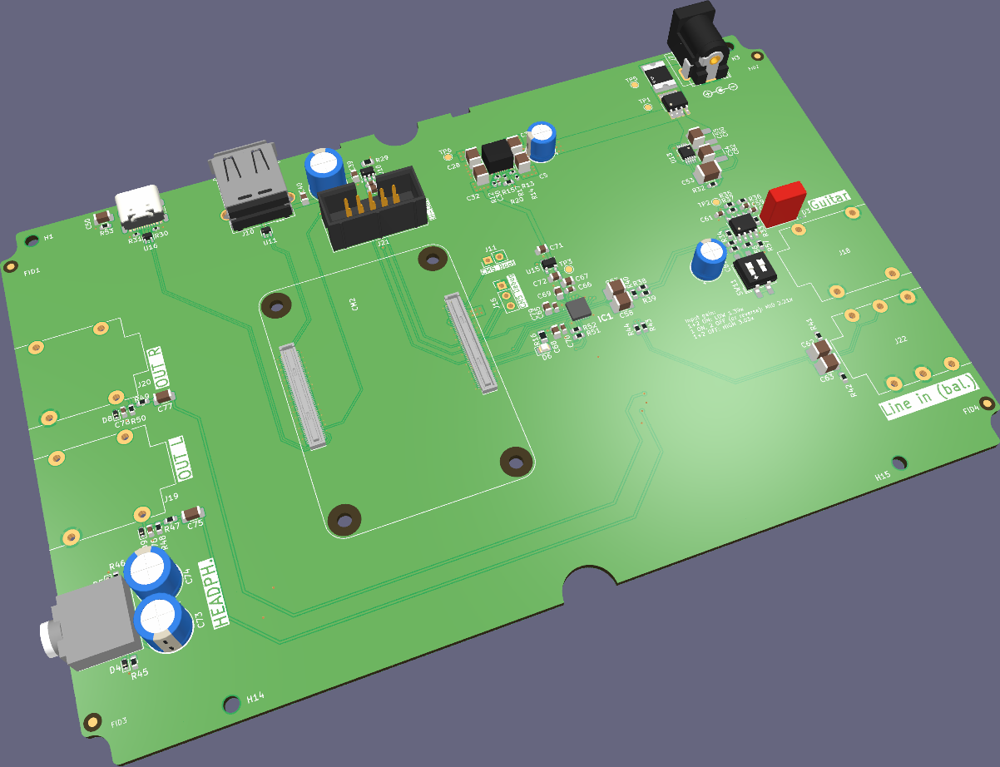

# Open Guitar Processing Platform.

A custom Raspberry Pi Compute Module 5 guitar-processing platform with integrated low-latency audio and a separate ESP32-S3 user-interface board.

  

The project is derived from various other similar projects:
https://github.com/pedalboard
https://rerdavies.github.io/pipedal/
https://www.treefallsound.com/

The hardware has been substantially redesigned around an integrated TAC5212 audio codec, CM5, and a separate UI controller.

The primary software target is the **pi-Stomp / MOD** stack. **PiPedal** is intended as an alternative audio environment using the same hardware.

## Design goals

The main priorities are:

1. Low audio latency
2. High audio quality and low noise
3. Simple hardware where additional complexity provides no meaningful benefit
4. Clean separation of switching, digital, and sensitive analog circuitry
5. Practical manufacture and assembly through JLCPCB
6. Straightforward hand assembly of parts that are impractical or unnecessarily expensive to have assembled

## System architecture

The system is split between two PCBs.

### Mainboard

The mainboard contains the complete audio and compute system:

- Raspberry Pi Compute Module 5
- TAC5212 stereo audio codec
- OPA1656 high-impedance guitar input front end
- Balanced line input
- Dedicated stereo headphone output
- Stereo line/amp output
- TLVM13660 main 5 V power supply
- Low-noise analog power supply
- Codec power supplies
- USB service/recovery connection
- External USB host connection
- Power and UART connection to the UI board

The mainboard is a **four-layer PCB**.

### UI board

The physical controls and display are moved to a separate PCB based on:

- ESP32-S3-WROOM-1U-N8R2
- 3.5-inch SPI TFT display
- Four rotary encoders with push switches
- Four footswitch inputs
- One expression-pedal input
- Up to four indicator LEDs
- Optional chassis-wired MIDI input/output
- Local 3.3 V power supply

The UI board receives 5 V from the mainboard.

Communication between the CM5 and ESP32-S3 uses **UART**. There is no USB connection between the CM5 and UI controller.

The CM5 can also control ESP32-S3 reset and boot mode through the UI interconnect.

## Software architecture

### Primary environment

The primary target is the **pi-Stomp** software environment using:

- MOD-UI
- mod-host
- JACK
- LV2 plugins
- Neural Amp Modeler compatible processing

The intention is to retain the useful pi-Stomp interaction model while adapting it to the custom hardware.

### Alternative environment

**PiPedal** is intended to run as an alternative software environment on the same hardware.

MOD and PiPedal are not intended to operate simultaneously. The system will select which audio environment is active.

### Division of responsibilities

The **CM5** handles:

- Audio processing
- Plugin hosting
- Audio-engine control
- Presets and pedalboards
- System state
- Parameter state
- Communication with the TAC5212
- Communication with the UI controller

The **ESP32-S3** handles:

- Display rendering
- Rotary encoders
- Encoder push switches
- Footswitches
- Expression-pedal sampling
- Indicator LEDs
- Optional future MIDI handling
- Sending user commands to the CM5

The CM5 sends state changes to the ESP32-S3 rather than rendering the user interface (The display) itself.

## Audio architecture

The audio system is built around the **TI TAC5212** codec.

The normal operating point is:

- 48 kHz sample rate
- Stereo I2S
- 32-bit slots
- CM5 as I2S clock producer
- TAC5212 as clock consumer
- No separate audio master-clock oscillator
- Low-latency TAC5212 ADC and DAC filter modes

### Guitar input

Input channel 1 is intended for passive electric guitar pickups.

An **OPA1656** provides the high-impedance input stage and converts the guitar signal to the differential signal required by the TAC5212.

The design provides approximately 1 MΩ guitar input impedance and includes selectable input gain.

The codec input is AC-coupled.

### Line input

Input channel 2 provides a balanced line-level input.

It is AC-coupled into the second differential TAC5212 ADC input.

### Outputs

The system provides:

- Dedicated stereo headphone output
- Stereo unbalanced line/amp output

The TAC5212's output capabilities are used directly where practical in order to avoid unnecessary additional analog stages.

## Power architecture

The board accepts an external DC supply and generates the required system rails locally.

The main power path consists of:

1. Input protection
2. Reverse-polarity protection
3. TLVM13660 switching regulator
4. Main 5 V system rail

The 5 V rail supplies the CM5 and the downstream power systems.

Separate low-noise supplies are used where appropriate for sensitive analog and codec circuitry.

The analog guitar front end uses a quiet higher-voltage rail to provide adequate signal headroom.

The UI board receives 5 V from the mainboard and generates its own local 3.3 V supply.

Power-supply layout, switching-current loops, grounding, thermal performance, and separation from the analog signal path are treated as critical PCB-layout requirements.

## Mainboard / UI connection

The mainboard and UI board use a keyed 10-pin connection carrying:

| Signal | Function |
|---|---|
| +5V_UI | UI-board power |
| GND | Power/signal return |
| CM5_UART_TX | CM5 to ESP32-S3 data |
| CM5_UART_RX | ESP32-S3 to CM5 data |
| UI_RESET_REQ | ESP32-S3 reset request |
| UI_BOOT_REQ | ESP32-S3 boot-mode request |

Multiple 5 V and ground contacts are used in the connector.

The connection is intended to use a short ribbon cable between the two boards.

## USB

USB is kept separate from the UI-controller connection.

The CM5 provides a USB service connection for functions including:

- CM5 recovery / eMMC flashing
- Wired system access
- USB networking

An external USB host connection is also retained.

The ESP32-S3 UI board does not require a USB connection to the CM5.

## MIDI

MIDI is not required for the initial build.

The UI design is intended to preserve the possibility of adding MIDI later without requiring another mainboard revision.

If implemented, MIDI connectors will be chassis-mounted and wired to dedicated connection points on the UI board, rather than placing large DIN/TRS connectors directly on the PCB.

## Mechanical design

The system is intended for installation in an aluminium pedal enclosure.

The mainboard carries the CM5 and audio electronics.

The separate UI board sits beneath the top panel and carries the display, footswitches and rotary controls.

The design must provide sufficient cooling for the CM5. A heatsink and fan are expected, with enclosure ventilation provided as necessary.

The use of a separate UI PCB reduces congestion around the CM5 and allows the display and controls to be positioned according to the enclosure rather than the mainboard layout.

## PCB design

The mainboard uses a **four-layer stackup**.

Important layout priorities include:

- Continuous low-impedance ground
- Small switching-regulator current loops
- Correct TLVM13660 thermal layout
- Separation of the switching supply from sensitive audio circuitry
- Short codec analog paths
- Short local decoupling connections
- Controlled digital return paths
- Sensible separation of CM5, power, codec, and analog regions
- Appropriate USB differential routing
- Good thermal paths for the CM5 and power supply

The PCB is intended for manufacture and partial assembly by **JLCPCB**.

Where performance is equivalent, readily available and economical assembly parts are preferred. More expensive or manually fitted components are used where they provide a meaningful electrical, mechanical, or sourcing advantage.

## Current status

The project is currently in the mainboard PCB-layout stage.

The major mainboard architecture and audio topology have been established.

Current work includes:

- Component placement and floorplanning
- TLVM13660 routing and thermal-via implementation
- Power-distribution layout
- Analog/digital partitioning
- Ground and return-current planning
- Final verification of the mainboard before manufacture

The separate ESP32-S3 UI PCB will be designed after the mainboard architecture and mechanical relationship between the two boards are sufficiently settled.

Because this is intended as a one-off build rather than an iterative prototype programme, schematic and PCB decisions are being reviewed carefully before manufacture.

## Repository structure

The main KiCad project contains the CM5, audio, power, and external-connectivity hardware.

Important documentation is kept under `Docs/`, including:

- `project-status.md` — current project state
- `decisions.md` — established design decisions and their reasoning
- `design-notes.md` — detailed engineering notes
- `work-log.md` — chronological record of completed work
- `mainboard-ui-transition-plan.md` — transition from the former integrated controller to the separate ESP32-S3 UI architecture

The UI PCB is intended to remain part of this repository as a separate KiCad project so that the two boards, their interconnect, and their firmware interface can be versioned together.

## Project history

This project began as a modification of the Open Pedalboard hardware.

The design has since moved substantially beyond the original architecture, including:

- CM5-only compute platform
- Integrated TAC5212 audio codec
- Custom high-impedance guitar front end
- Revised audio outputs
- Revised power architecture
- Four-layer PCB
- TLVM13660 main supply
- Separate ESP32-S3 UI controller
- UART-based CM5/UI communication
- pi-Stomp/MOD as the primary software direction

The original Open Pedalboard project remains an important hardware and software reference.

## License

This project is derived from Open Pedalboard hardware.

See the repository license files and the original Open Pedalboard project for applicable licensing information.
